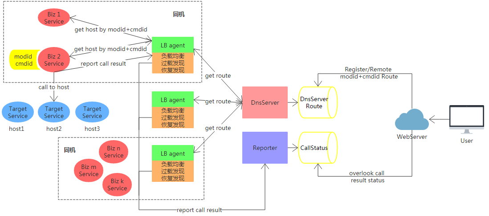

# Easy Load Balancer

ELB（Easy Load Balance）是一个简单、易用、高性能的服务间远程调用管理、调度、负载系统

此系统的闭源版本已经在我司300+台服务器、2000+个远程服务上自2017年4月稳定运行至今

**PS：** 本系统各组件的网络框架直接采用了我做的另一个项目：[高性能C++多线程Reactor网络服务框架：Easy-Reactor][1]，以顺便检验Easy-Reactor项目的性能和可用性。ELB系统开发完成后，事实证明系统性能还是很好的:-D （如：组件LB Agent QPS `50+W/s`，组件dnsserver QPS 3线程时`25+W/s`、5线程时`39+W/s`，具体各组件的性能测试见各组件的README）

[1]: https://github.com/LeechanX/Easy-Reactor

### 介绍

对于一个部门的后台，为增强灵活性，一个服务可以被抽象为命令字：`modid+cmdid`的组合，称为**一个模块**，而这个服务往往有多个服务节点，其所有服务节点的地址集合被称为这个模块下的**路由**，节点地址简称为节点

- `modid`：标识业务的大类，如：“直播列表相关”
- `cmdid`：标识具体服务内容，如：“批量获取直播列表”

业务代码利用modid,cmdid，就可以调用对应的远程服务

一个ELB系统包含一个dnsserver，一个reporter，以及部署于每个服务器的Lbagent，业务代码通过API与ELB系统进行交互

**API** ：根据自身需要的`modid,cmdid`，向ELB系统获取节点、汇报节点调用结果；提供`C++`、`Java`、`Python`接口

**LB agent**：运行于每个服务器上，负责为此服务器上的业务提供节点获取、节点状态汇报、路由管理、负载调度等核心功能

**dnsserver** ： 运行于一台服务器上（也可以用LVS部署多实例防单点），负责`modid,cmdid`到节点路由的转换

**reporter** ： 运行于dnsserver同机服务器上，负责收集各`modid,cmdid`下各节点调用状况，可用于观察、报警

`modid,cmdid`数据由`Mysql`管理，具体SQL脚本在`common/sql`路径下
至于`modid,cmdid`的注册、删除可以利用Web端操作MySQL（但由于个人能力有限，Web没有写）

### 总体架构

如图，每个服务器（虚线）部署了一台LB Agent，以及多个业务服务

1. 开发者在Web端注册、删除、修改`modid,cmdid`的路由信息，信息被写入到MySQL数据库；
2. 服务器上每个业务biz都把持着自己需要通信的远程服务标识`modid+cmdid`，每个biz都向本机LB Agent获取远程节点，进而可以和远程目标服务通信，此外biz会汇报本次的节点调用结果给LB Agent；
3. LB Agent负责路由管理、负载均衡等核心任务，并周期性向dnsserver获取最新的路由信息，周期性把各`modid,cmdid`的各节点一段时间内的调用结果传给reporter
4. dnsserver监控MySQL，周期性将最新路由信息加载出来；
5. reporter将各`modid,cmdid`的各节点一段时间内的调用结果写回到MySQL，方便Web端查看、报警

### 各组件架构原理介绍
**DNS Server: [dnsserver readme][2]**

[2]: https://github.com/LeechanX/Easy-Load-Balancer/blob/master/dnsserver/README.md

**LB Agent: [lb agent readme][3]**

[3]: https://github.com/LeechanX/Easy-Load-Balancer/blob/master/lbagent/README.md

**Reporter: [reporter readme][4]**

[4]: https://github.com/LeechanX/Easy-Load-Balancer/blob/master/reporter/README.md

**API: [API readme][5]**

[5]: https://github.com/LeechanX/Easy-Load-Balancer/blob/master/api/README.md

### TODO

- LB算法对节的异构性考虑不够细致，值得优化
- 增加更多语言API
