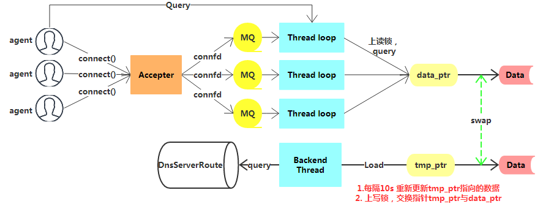

## Arch

### **server model**
DnsServer服务模型采用了one loop per thread TCP服务器：
- 主线程Accepter负责接收连接（agent端连接）
- Thread loop们负责处理连接的请求、回复；（agent端发送查询请求，期望获取结果）

### **business model**
DnsServer使用两个map存储路由数据（key = `modid<<32 + cmdid` ， value = set of `ip<<32 + port`）
- 一个map：主数据，查询请求在此map执行
- 另一个map：后台线程周期性重加载路由到此map，作为最新数据替换掉上一个map

这两个map分别由指针`data_ptr`与`tmp_ptr`指向

#### **dnsserver还有个业务线程:**

- Backend Thread：负责周期性（default:10s）重加载DnsServerRoute表内容到`tmp_ptr`指向的map，而后上写锁，交换指针`data_ptr`与`tmp_ptr`的地址，于是完成了路由数据更新

### **in service**
服务启动时，DnsServerRoute表被加载到`data_ptr`指向的map中, `tmp_ptr`指向的map为空

服务启动后，agent发来Query for 某modid/cmdid，其所在Thread Loop上，上读锁查询`data_ptr`指向的map，返回查询结果；
顺便如果此moid,cmdid不存在，则把agent ip+agent port+此moid+cmdid发送到Backend thread loop1的队列，让其记录到ClientMap

后台线程Backend thread每隔10s清空`tmp_ptr`指向的map，再加载DnsServerRoute表内容到`tmp_ptr`指向的map，加载成功后交换指针`data_ptr`与`tmp_ptr`指针内容，于是完成了路由数据的更新

