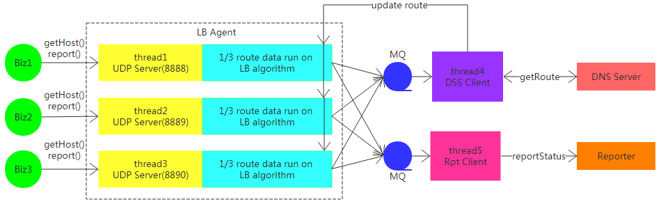

## Lb Agent Presentation

### **feature**

一个服务称为一个模块，一个模块由modid+cmdid来标识
modid+cmdid的组合表示一个远程服务，这个远程服务一般部署在多个节点上

LB Agent以UDP方式为业务方提供：1、节点获取服务；2、节点调用结果上报服务
#### 1、节点获取服务：
业务方每次要向远程服务发送消息时，先利用modid+cmdid去向LB Agent获取一个可用节点，然后向该节点发送消息，完成一次远程调用；具体获取modid+cmdid下的哪个节点是由LB Agent负责的

#### 2、节点调用结果上报服务
对LB Agent节点的一次远程调用后，调用结果会汇报给LB Agent，以便LB Agent根据自身的LB算法来感知远程服务节点的状态是空闲还是过载，进而控制节点获取时的节点调度

LB Agent拥有5个线程，一个LB算法：

- UDP Server服务，并运行LB算法，对业务提供节点获取和节点调用结果上报服务；为了增大系统吞吐量，使用3个UDP Server服务互相独立运行LB算法：`modid+cmdid % 3 = i`的那些模块的服务与调度，由第`i+1`个UDP Server线程负责

- DSS Client：是dnsserver的客户端线程，负责根据需要，向dnsserver获取一个模块的节点集合（或称为获取路由）；UDP Server会按需向此线程的MQ写入获取路由请求，DSS Client将MQ到来的请求转发到dnsserver，之后将dnsserver返回的路由信息更新到对应的UDP Server线程维护的路由信息中
- Rpt Client：是reporter的客户端线程，负责将每个模块下所有节点在一段时间内的调用结果、过载情况上报到reporter端，便于观察情况、做报警；本身消费MQ数据，UDP Server会按需向MQ写入上报状态请求

### **business model**
#### **1、节点获取服务getHost**

- 当业务方调用API：getHost，将利用自己需要的modid+cmdid，先计算i = (modid+cmdid)%3，然后向LB Agent的第i+1个UDP Server获取节点
- LB Agent收到getHost请求，在内存查询是否有要求模块的路由；如果没有，返回不存在给API；否则由LB算法选择一个可用节点、或返回过载错误给API
- getHost也驱动着向Dss Client传递拉取路由请求：
 + 如果模块modid+cmdid不存在，会打包一个拉取此模块路由的请求，发给Dss Client线程MQ；（作为首次拉取路由）
 + 如果模块modid+cmdid上次拉取路由时间距今超时（默认15s），也打包一个拉取此模块路由的请求，发给Dss Client线程MQ；（作为路由更新）

#### **2、节点调用结果上报服务**
- 当业务方调用API：`report(modid, cmdid, ip, port, retcode)`，将利用自己需要的modid+cmdid，先计算`i = (modid+cmdid)%3`，然后向LB Agent的第`i+1`个UDP Server上报对节点`(ip, port)`的调用结果
- LB Agent获取到report请求，而后根据调用结果，更新LB算法维护的该modid,cmdid下该节点ip,port的调用信息，用于LB算法调度
- 一次report后，LB Agent顺便会决定是否向reporter上报最近一段时间（默认15秒）的该模块的调用结果，决定方式是上次上报时间距今是否超时（到15秒）；如果已经超时，则将模块近期调用结果打包为上报请求交给Rpt Client的MQ
- Rpt Client消费MQ，拿到上报请求，而后发送给reporter

### Timer Event
#### 1、自身心跳记录
LB Agent会每隔1秒钟向共享内存写入此时的时间戳（秒），以便业务API及时发现是否LB Agent已宕机；

业务API每次获取节点前，会对比当前时间与共享内存中的时间，如果相差超过2s，认为LB Agent已经宕机，则转而向持久化到本地磁盘的静态路由中随机获取一个要求模块的节点

#### 2、周期性路由落地
LB Agent每隔60秒向磁盘落地自身保存的所有模块的路由信息，作为静态路由；以便在LB Agent宕机后，可以由静态数据继续对业务提供节点获取服务

### **performance**

服务器参数：

CPU个数：24   内存：128GB   网卡队列个数：24

qpstest使用30个线程并发访问lbagent，压满lbagent UDP Server的3个线程CPU

QPS测试结果：`≈50.96W/s`

### **PS**
除了节点获取服务、节点调用结果上报服务，LB Agent还为工具提供模块路由获取服务

###LB Algorithm

TO WRITE
