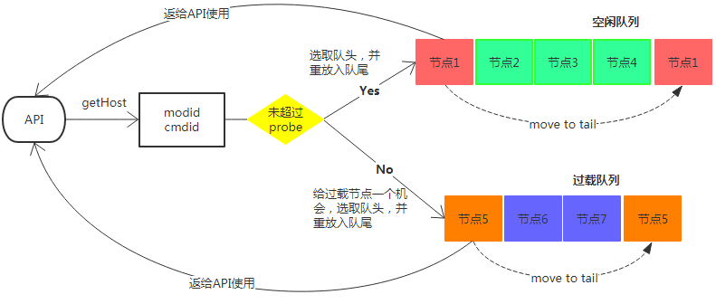

## Lb Agent Presentation

### **feature**

一个服务称为一个模块，一个模块由modid+cmdid来标识
modid+cmdid的组合表示一个远程服务，这个远程服务一般部署在多个节点上

LB Agent以UDP方式为业务方提供：1、节点获取服务；2、节点调用结果上报服务
#### 1、节点获取服务：
业务方每次要向远程服务发送消息时，先利用modid+cmdid去向LB Agent获取一个可用节点，然后向该节点发送消息，完成一次远程调用；具体获取modid+cmdid下的哪个节点是由LB Agent负责的

#### 2、节点调用结果上报服务
对LB Agent节点的一次远程调用后，调用结果会汇报给LB Agent，以便LB Agent根据自身的LB算法来感知远程服务节点的状态是空闲还是过载，进而控制节点获取时的节点调度

LB Agent拥有5个线程，一个LB算法：

- UDP Server服务，并运行LB算法，对业务提供节点获取和节点调用结果上报服务；为了增大系统吞吐量，使用3个UDP Server服务互相独立运行LB算法：`modid+cmdid % 3 = i`的那些模块的服务与调度，由第`i+1`个UDP Server线程负责

- DSS Client：是dnsserver的客户端线程，负责根据需要，向dnsserver获取一个模块的节点集合（或称为获取路由）；UDP Server会按需向此线程的MQ写入获取路由请求，DSS Client将MQ到来的请求转发到dnsserver，之后将dnsserver返回的路由信息更新到对应的UDP Server线程维护的路由信息中
- Rpt Client：是reporter的客户端线程，负责将每个模块下所有节点在一段时间内的调用结果、过载情况上报到reporter端，便于观察情况、做报警；本身消费MQ数据，UDP Server会按需向MQ写入上报状态请求

### **business model**
#### **1、节点获取服务getHost**

1. 当业务方调用API：getHost，将利用自己需要的modid+cmdid，先计算i = (modid+cmdid)%3，然后向LB Agent的第i+1个UDP Server获取节点
2. LB Agent收到getHost请求，在内存查询是否有要求模块的路由；如果没有，返回不存在给API；否则由LB算法选择一个可用节点、或返回过载错误给API
3. getHost也驱动着向Dss Client传递拉取路由请求：
    1. 如果模块modid+cmdid不存在，会打包一个拉取此模块路由的请求，发给Dss Client线程MQ；（作为首次拉取路由）
    2. 如果模块modid+cmdid上次拉取路由时间距今超时（默认15s），也打包一个拉取此模块路由的请求，发给Dss Client线程MQ；（作为路由更新）

#### **2、节点调用结果上报服务**
1. 当业务方调用API：`report(modid, cmdid, ip, port, retcode)`，将利用自己需要的modid+cmdid，先计算`i = (modid+cmdid)%3`，然后向LB Agent的第`i+1`个UDP Server上报对节点`(ip, port)`的调用结果
2. LB Agent获取到report请求，而后根据调用结果，更新LB算法维护的该modid,cmdid下该节点ip,port的调用信息，用于LB算法调度
3. 一次report后，LB Agent顺便会决定是否向reporter上报最近一段时间（默认15秒）的该模块的调用结果，决定方式是上次上报时间距今是否超时（到15秒）；如果已经超时，则将模块近期调用结果打包为上报请求交给Rpt Client的MQ
4. Rpt Client消费MQ，拿到上报请求，而后发送给reporter

### Timer Event
#### 1、自身心跳记录
LB Agent会每隔1秒钟向共享内存写入此时的时间戳（秒），以便业务API及时发现是否LB Agent已宕机；

业务API每次获取节点前，会对比当前时间与共享内存中的时间，如果相差超过2s，认为LB Agent已经宕机，则转而向持久化到本地磁盘的静态路由中随机获取一个要求模块的节点

#### 2、周期性路由落地
LB Agent每隔60秒向磁盘落地自身保存的所有模块的路由信息，作为静态路由；以便在LB Agent宕机后，可以由静态数据继续对业务提供节点获取服务

### **performance**

服务器参数：

CPU个数：24   内存：128GB   网卡队列个数：24

qpstest使用30个线程并发访问lbagent，压满lbagent UDP Server的3个线程CPU

QPS测试结果：`≈50.96W/s`

### **PS**
除了节点获取服务、节点调用结果上报服务，LB Agent还为工具提供模块路由获取服务

### LB Algorithm

### 一、基础

每个模块（modid+cmdid）下有若干节点，节点的集合称为此模块的路由；
对于每个节点，有两种状态：
- idle：此节点可用，可作为API请求的节点使用；
- overload：此节点过载，暂时不可作为API请求的节点使用；

在请求节点时，

有如下几个关键属性：
- 虚拟成功次数`vsucc`，API汇报节点调用结果是成功时，该值+1
- 虚拟失败次数`verr`，API汇报节点调用结果是失败时，该值+1
- 连续成功次数，顾名思义
- 连续失败次数，顾名思义

以上4个字段在节点状态改变时（idle<->overload）会被重置

### 二、调度方式
LB算法对每个模块路由维护两个队列：空闲队列、过载队列，空闲队列放置空闲节点，过载队列放置过载节点
最初，模块下所有节点都处于空闲队列

如图，当API对某模块发起节点获取时：
- LB从空闲队列拿出队列头部节点，作为选取的节点返回，同时将此节点重追到队列尾部；
- **probe机制** ：如果此模块过载队列非空，则每经过probeNum次节点获取后（默认=10），给过载队列中的节点一个机会，从过载队列拿出队列头部节点，作为选取的节点返回，让API试探性的用一下，同时将此节点重追到队列尾部；
- 如果空闲队列为空，说明整个模块过载了，返回过载错误；且也会经过probeNum次节点获取后（默认=10），给过载队列中的节点一个机会，从过载队列拿出队列头部节点，作为选取的节点返回，让API试探性的用一下，同时将此节点重追到队列尾部；

>调度就是：从空闲队列轮流选择节点；同时利用probe机制，给过载队列中节点一些被选择的机会

### 三、过载判断

依赖于API对节点调用结果的汇报

#### 1、idle节点关注失败率，overload节点关注成功率
>节点失败率 = 节点`verr` / (`vsucc` + `verr`)
>节点成功率 = 节点`vsucc` / (`vsucc` + `verr`)

当idle节点的失败率>预设值（默认10%），将节点判定为overload；
当overload节点的成功率>预设值（默认95%），将节点判定为idle；

而不可以idle/overload节点都只关注成功率or都只关注失败率，这样可能造成节点在idle/overload状态间频繁切换
为idle节点、overload节点设置不同的阈值可以区别对待

#### 2、连续成功、连续失败
为了加速对宕机节点的发现
当idle节点连续失败次数超过预设值（默认15），将节点判定为overload；
而当overload节点连续成功次数超过预设值（默认15），将节点判定为idle；

#### 3、预设初始虚拟成功个数、预设过载虚拟失败个数

假设节点idle时初始:`vsucc = 0, verr = 0`，则第一次对该节点调用失败会使得此节点失败率 = 100%，被判定为overload
为了在idle初始状态时不会因为少量错误就被判定为overload，当节点变为idle状态时，预设虚拟成功个数（默认180）

假设节点overload时初始:`vsucc = 0, verr = 0`，则第一次对该节点调用成功会使得此节点成功率 = 100%，被判定为idle
为了在idle初始状态时不会因为少量成功就被判定为idle，当节点变为overload状态时，预设虚拟失败个数（默认5）

#### 4、idle节点设置统计窗口

假设节点h长期处于idle，已经累计`vsucc = 100000, err = 0`；此时突然h过载，API调用产生了大量的错误，假设汇报了500个失败，于是`verr = 500`，此时节点的失败率0.5%，尚未被判定为过载；且因为之前长期运行的成功个数太多，使得需要更多的错误汇报才会让LB感知到h过载

将idle节点每隔一定时间（默认15s）重置为idle初始状态（`vsucc = 270, verr = 0`）
于是将节点的运行情况按照15s分隔，我们永远只关注当前15s内此节点的状态，于是过载的节点将会被更快感知

#### 5、overload设置过载超时

当节点被判定为overload后超过一段时间（默认3min），将此节点强制判定为idle状态，即强行认为经过3min，节点已经恢复了
即使节点实际上并没有从overload中恢复，接下来此节点依然会被很快地判定为overload

### FAQ

>init_succ = 180，err_rate = 0.1
>而 ： 10succ+21err 才过载，实际失败率并不是0.1啊？

答：

实际上，观察一组数据：

10succ+21err 过载  实际rate=67%
20succ+22err  过载 实际rate=50%
......
90succ + 30err  过载 实际rate=25%
......
200succ + 42err 过载，实际rate=17%
......
500succ + 75err 过载，实际rate=13%
即量越大越接近我们设定的=10%

而量越小，失败率更大才会导致过载

**这样的设计是很好的，因为量小的时候不应该武断的认为10%就过载，比如10succ+2err就会过载，才失败了两次，但是达到了10%，所以过载了，这是很不合理的**

我们的init_succ弄巧成拙的在这方面防止了这个情况（本来只想用他防止一上来就失败过载的情况）

### 实际使用反馈与优化

[优化日志][1]

[1]: https://github.com/LeechanX/Easy-Load-Balancer/blob/master/lbagent/Optimization-log.md