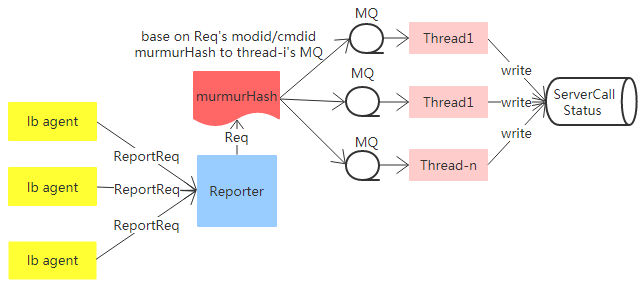

## Reporter Presentation
### **feature**
负责接收各agent对某modid、cmdid下节点的调用状态的上报

请求内容包括：
>modid，cmdid，上报者agent的ip，上报时间，是否过载，以及其下所有节点的调用结果：成功个数，失败个数

### **principle arch**

### **server model**

Reporter服务模型采用了single thread TCP服务器 + 线程池处理请求

- 主线程Reporter负责接收agent请求，并根据请求中携带的`modid`和`cmdid`，拼接后进行`murmurHash`，分配到某个线程的MQ上
- Thread 1~N们负责处理请求：把MQ上的请求中的数据同步更新到MySQL数据表

由于agent上报给Reporter的信息是携带时间的，且仅作为前台展示方便查看服务的过载情况，故通信仅有请求没有响应

于是Reporter服务只要可以高效读取请求即可，后端写数据库的实时性能要求不高
